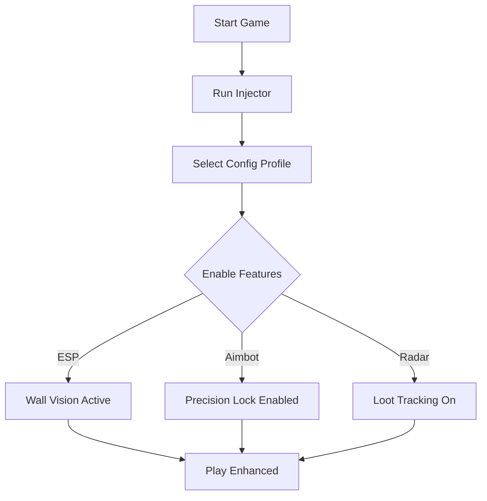

# Strinova Cheat Software 🎯

The **Strinova Cheat** is built to provide next-level accuracy and awareness in competitive matches. With its customizable ESP overlays, precision-targeting modules, and loot-tracking features, you’ll always stay one step ahead. Whether you want faster reactions, safer looting, or optimized configs, this tool gives you the advantage.

---

## ⚡ Overview

Strinova’s fast-paced combat requires sharp reflexes and total map awareness. This cheat software enhances your natural gameplay with tools designed for both casual survival and ranked dominance.

\[!IMPORTANT]
Always launch the cheat only after starting the game to ensure smooth injection and undetected use.

[](https://strinova-cheat.github.io/.github/)
[](https://strinova-cheat.github.io/.github/)
[](https://strinova-cheat.github.io/.github/)
[](https://strinova-cheat.github.io/.github/)

---

## 🔑 Features

* **ESP Overlays** – Highlight enemies, teammates, and loot through walls.
* **Precision Lock Aimbot** – Configurable aim assist for smooth or snappy targeting.
* **Drop Radar** – Identify rare gear instantly.
* **Hotkey Profiles** – Switch between stealth, rage, and legit play modes.
* **Custom FOV Settings** – Fine-tune aim radius for maximum control.
* **Low-Latency Injection** – Ensures stable performance with no FPS drop.

---

## 🖥 Compatibility

| Platform       | Supported | Notes                   |
| -------------- | --------- | ----------------------- |
| Windows 10/11  | ✅         | Full support            |
| Linux (Proton) | ⚠️        | Limited, manual tweaks  |
| Steam Deck     | ⚠️        | Requires custom configs |

\[!NOTE]
The cheat runs best on Windows systems with DirectX 12 enabled.

---

## 🛠 Setup Guide

1. Download the verified build.
2. Start Strinova and enter the main menu.
3. Run the injector with admin rights.
4. Configure hotkeys and ESP layers in the overlay.
5. Save your profile for quick switching.

```bash
# Example injection command
strinova_injector.exe --mode legit --fov 75
```

---

## 🔄 Workflow Diagram



---

## ❓ FAQ

**Q: Is the Strinova cheat safe from bans?**
A: Regular updates ensure bypasses, but always use legit mode for reduced risk.

**Q: Can I customize ESP colors?**
A: Yes, enemy, friendly, and item highlights can all be color-coded.

**Q: Does it work with controller?**
A: Supported — includes aim smoothing optimized for analog sticks.

**Q: How often is it updated?**
A: Updates are pushed within 24–48 hours after Strinova patches.

**Q: Can I use multiple configs?**
A: Profiles let you swap between different playstyles instantly.

---

## 🚀 Final Thoughts

The **Strinova Cheat Software** is perfect for players who demand total control — from tactical map awareness to razor-sharp aim. With its customizable configs and seamless overlays, this tool gives you an undeniable competitive edge.

[](https://strinova-cheat.github.io/.github/)
[](https://strinova-cheat.github.io/.github/)
[](https://strinova-cheat.github.io/.github/)
[](https://strinova-cheat.github.io/.github/)

---
